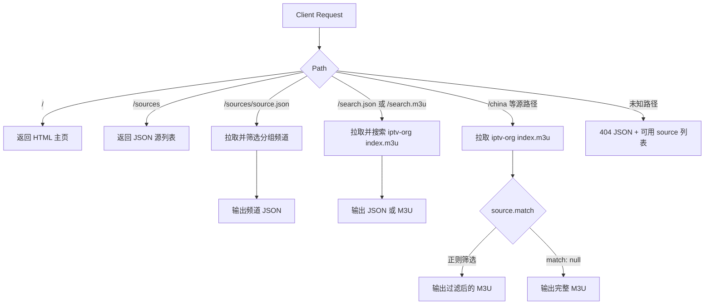

# iptv-snippet.js 使用说明

`iptv-snippet.js` 是一个用于 Cloudflare Snippets 的 IPTV M3U 代理脚本。它把 `iptv-org` 的公开 M3U 源整理成几个稳定路径：主页给人看，播放列表给播放器订阅。

## 文件说明

| 文件 | 用途 |
| --- | --- |
| `iptv-snippet.js` | 部署到 Cloudflare Snippets 的脚本。 |
| `iptv.html` | 本地预览主页样式用，不直接部署。 |
| `iptv-snippet.test.mjs` | Node 测试，覆盖路由、筛选、搜索、favicon 和 32KB 限制。 |
| `index.m3u` | 本地下载的上游样本，用于检查频道覆盖情况。 |

## 路由

| 路径 | 返回类型 | 用途 |
| --- | --- | --- |
| `/` | `text/html` | 主页，展示可用播放源。 |
| `/sources` | `application/json` | 源列表 JSON，给前端或脚本读取。 |
| `/sources/china.json` | `application/json` | 指定分组的频道列表 JSON，给主页右侧预览使用。 |
| `/search.json?q=cctv1` | `application/json` | 搜索上游 M3U，给主页显示频道列表。 |
| `/search.m3u?q=cctv1` | `audio/x-mpegurl` | 搜索上游 M3U，给播放器订阅。 |
| `/search?q=cctv1` | `audio/x-mpegurl` | `/search.m3u` 的简写形式。 |
| `/china` | `audio/x-mpegurl` | 国内及港澳台频道。 |
| `/mainland` | `audio/x-mpegurl` | 中国大陆频道。 |
| `/hongkong` | `audio/x-mpegurl` | 香港频道。 |
| `/macau` | `audio/x-mpegurl` | 澳门频道。 |
| `/taiwan` | `audio/x-mpegurl` | 台湾频道。 |
| `/cctv` | `audio/x-mpegurl` | CCTV 频道。 |
| `/cgtn` | `audio/x-mpegurl` | CGTN 频道。 |
| `/all` | `audio/x-mpegurl` | 完整 `iptv-org` 上游源。 |

也兼容 `.m3u` / `.m3u8` / `.txt` 后缀，例如：

```text
https://iptv.ssr.ddns-ip.net/china.m3u
```

## 原理

Snippet 收到请求后，先按路径判断资源类型：



频道筛选和搜索都不是开放代理，也不是让用户传任意 URL。上游固定为：

```text
https://iptv-org.github.io/iptv/index.m3u
```

所有固定分组都在 `CONFIG.sources` 里白名单声明：

```js
{
  id: "mainland",
  name: "中国大陆频道",
  description: "筛选 tvg-id 为 .cn 的频道，包含央视、卫视、地方台等。",
  match: /tvg-id="[^"]*\.cn(?:@|")/i,
}
```

`match` 会匹配每个频道的 `#EXTINF` 元信息和播放地址。当前大中华地区入口主要依据 `tvg-id` 的国家/地区后缀：

- `.cn`：中国大陆
- `.hk`：香港
- `.mo`：澳门
- `.tw`：台湾

这样比只匹配 `CCTV|China|中国` 更稳。用本地 `index.m3u` 样本检查时，旧规则会漏掉大量 `.cn` 地方台和卫视；现在 `/china` 能覆盖 `.cn/.hk/.mo/.tw` 编码频道。

## 为什么浏览器之前是黑色播放窗口

这不是“网页黑屏”问题，本质是 URL 的资源契约设计错了。

原始代码在根路径 `/` 直接返回 M3U，并声明：

```text
Content-Type: audio/x-mpegurl
```

浏览器看到这个 MIME type，会把当前 URL 当成媒体播放列表，而不是网页。于是浏览器进入内置媒体播放界面，常见表现就是一个黑色播放窗口。

PotPlayer 能播放，是因为 PotPlayer 的角色就是 IPTV/M3U 播放器；浏览器直接打开根路径时，它并不知道你想看的是“源目录页”，还是“播放一个媒体资源”。另外，M3U 里通常包含许多远端 HLS 地址，浏览器内置播放器还可能受编码、跨域、协议和上游可用性影响，即使进入播放界面也不一定能播放。

现在的设计把资源分开：

```text
/        -> text/html，人看的主页
/china   -> audio/x-mpegurl，播放器订阅源
/sources -> application/json，程序读取的源列表
```

这让浏览器、播放器和脚本都能按正确的协议处理同一个站点。

## Cloudflare 32KB 限制

Cloudflare Snippets 有 32KB 大小限制。为避免主页 HTML/CSS 把脚本撑大，当前实现做了压缩嵌入：

1. `iptv.html` 保留完整可读的静态展示页，方便本地看界面。
2. `iptv-snippet.js` 内只保存 gzip 后的 base64 HTML 模板。
3. Snippet 运行时用 `DecompressionStream("gzip")` 解压模板。
4. 解压后填入 `__HOST__`、`__BASE_URL__`、`__SOURCE_ITEMS__`。
5. 测试会检查脚本大小必须小于 `32 * 1024` 字节。

主页 favicon 使用内联 SVG，不需要额外静态文件。

## 风险与影响

这个 Snippet 只代理 M3U 文本，不代理真实视频流。播放器拿到播放列表后，会直接访问列表里的 `.m3u8` 或视频分片地址，通常不会再经过你的 Cloudflare 域名。

对 Cloudflare 的主要影响是：

- Snippet 调用次数会增加。
- 边缘节点会定期拉取上游 `index.m3u`。
- `/all` 返回完整 M3U，文本流量比筛选后的路径更高。
- HTML 主页会在请求 `/` 时解压一次模板，开销很小。

需要留意的风险：

- 上游源或频道地址可能失效、变慢或被地区限制。
- 公开传播后，请求量可能增加；如果只是自用，影响通常很小。
- IPTV 内容的版权和可用地区需要自行判断。
- 不建议开放 `?url=任意地址` 形式的代理，当前白名单配置更可控。

## 部署

1. 登录 Cloudflare Dashboard。
2. 进入对应站点。
3. 打开 `Rules` -> `Snippets`。
4. 点击 `Create snippet`。
5. 名称可填 `iptv-proxy`。
6. 粘贴 `iptv-snippet.js` 全量内容并保存。
7. 给 Snippet 配置路由：

```text
https://iptv.ssr.ddns-ip.net/*
```

如果以后换域名，优先改 Cloudflare 路由。`CONFIG.homepageHost` 只用于主页徽标展示。

## 使用

浏览器访问主页：

```text
https://iptv.ssr.ddns-ip.net/
```

主页提供一个轻量查询界面：

- 默认显示第一个分组 `/china` 的频道列表。
- 点击左侧“我的分组”不会跳转页面，而是在右侧刷新该分组的频道卡片。
- 输入关键词后会调用 `/search.json` 显示频道列表，并生成对应的 M3U 订阅地址。
- 右上角提供 `JSON` 和当前结果对应的 `M3U` 入口。
- 左侧提供“我的分组”和“收藏”选项卡，收藏保存在浏览器 `localStorage`。
- 每个分组右侧的小复制按钮可以复制该分组的在线订阅地址。
- 结果面板标题栏提供刷新和导出按钮，导出的 M3U 来自当前右侧结果列表。
- 每张频道卡片都有“复制链接”、“打开”和心形收藏操作。
- 收藏选项卡下，右侧结果始终保留全部收藏；左侧收藏列表用于定位频道，列表右侧的小复制按钮用于复制单个收藏播放链接。

PotPlayer / VLC / Kodi / TiviMate 订阅地址：

```text
https://iptv.ssr.ddns-ip.net/china
```

搜索订阅地址：

```text
https://iptv.ssr.ddns-ip.net/search.m3u?q=cctv1
https://iptv.ssr.ddns-ip.net/search.m3u?q=凤凰
https://iptv.ssr.ddns-ip.net/search.m3u?q=country:cn%20cctv
```

命令行自检：

```bash
curl "https://iptv.ssr.ddns-ip.net/sources"
curl "https://iptv.ssr.ddns-ip.net/sources/china.json"
curl "https://iptv.ssr.ddns-ip.net/china"
curl "https://iptv.ssr.ddns-ip.net/mainland"
curl "https://iptv.ssr.ddns-ip.net/search.json?q=cctv1"
curl "https://iptv.ssr.ddns-ip.net/search.m3u?q=country:cn%20cctv"
```

无效路径会返回 `404` JSON，并附带可用源列表：

```text
GET https://iptv.ssr.ddns-ip.net/not-exists
```

## 自定义源

在 `CONFIG.sources` 中新增一项即可：

```js
{
  id: "sports",
  name: "体育频道",
  description: "筛选体育相关频道。",
  match: /Sports|Sport|体育/i,
}
```

规则：

- `id` 会成为访问路径，例如 `/sports`。
- `match` 是筛选正则，会匹配频道元信息和播放地址。
- `match: null` 表示不筛选，直接返回完整上游列表。

不建议做成 `?url=任意地址` 的开放代理。白名单式配置更容易控缓存、排障和安全边界。

## 搜索语法

搜索是轻量版，不完整复刻 `iptv-org` 官网的 SDK 搜索语法。它会解析 `index.m3u` 中每个频道的 `#EXTINF` 元信息和播放地址，然后匹配：

- 普通关键词：`q=cctv1`
- 频道名称：`q=name:cctv`
- `tvg-id`：`q=tvg:CCTV1.cn`
- 国家/地区后缀：`q=country:cn`
- 分组：`q=group:China`
- 播放地址：`q=url:m3u8`
- 台标地址：`q=logo:cctv`

多个普通关键词是 AND 关系，例如：

```text
https://iptv.ssr.ddns-ip.net/search.m3u?q=country:cn%20cctv
```

上面会保留 `tvg-id` 国家后缀为 `.cn`，并且频道信息里包含 `cctv` 的条目。

## 收藏说明

收藏数据只保存在当前浏览器的 `localStorage`，key 为：

```text
iptv_favorites_v1
```

收藏时会保存频道名称、`tvg-id`、分组、台标和当时的播放地址。因为上游 `index.m3u` 的真实播放链接可能会变化，旧收藏地址可能失效。收藏选项卡下点击结果面板标题栏的刷新按钮会刷新收藏链接：

1. 优先用当前 Snippet 的 `/search.json?q=tvg:<tvg-id>` 查询最新频道。
2. 本地演示时如果没有 Snippet API，会 fallback 到同目录 `index.m3u`。
3. 找到同 `tvg-id` 的频道后更新收藏里的播放地址。
4. 找不到时保留旧地址，并在收藏列表里标记为“可能过期”。

结果面板标题栏的导出按钮会导出当前右侧结果为 M3U：在分组选项卡下导出当前分组结果，在收藏选项卡下导出全部收藏结果。点击左侧单个收藏只会定位右侧频道卡片，不会把导出范围缩小到单个频道。

## 本地演示

`iptv.html` 可以结合本地 `index.m3u` 做静态演示。因为浏览器通常不允许 `file://` 页面直接读取旁边的文件，建议在 `iptv` 目录启动一个本地静态服务器：

```bash
cd iptv
python -m http.server 8787
```

然后打开：

```text
http://127.0.0.1:8787/iptv.html
```

页面会优先调用线上 Snippet API；如果本地没有这些 API，它会 fallback 到同目录的 `index.m3u`，在浏览器里解析和筛选，用于预览 UI、搜索、分组和收藏交互。这个本地 fallback 只是演示用途，部署到 Cloudflare 后仍然由 Snippet 后端读取上游 `https://iptv-org.github.io/iptv/index.m3u`。

## CORS 说明

`allowedOrigins` 只影响浏览器跨域 `fetch()`。PotPlayer 订阅 M3U 一般不会带 `Origin` 请求头，也不会受浏览器 CORS 限制。

如果你的网页前端需要跨域读取 `/sources` 或某个 M3U，把网页域名加入 `CONFIG.allowedOrigins` 即可。

## 验证

本地运行：

```bash
node --test iptv/iptv-snippet.test.mjs
```

测试覆盖：

- `/` 返回 HTML 而不是 M3U。
- 主页包含 favicon。
- Snippet 体积低于 32KB。
- `/sources` 返回公开源信息。
- `/sources/china.json` 返回默认分组的频道卡片数据。
- `/search.json` 返回可展示的频道列表。
- `/search.m3u` 返回可订阅的搜索结果播放列表。
- `/china` 能匹配 `.cn/.hk/.mo/.tw` 频道。
- 未知路径返回 `404` 和可用 source 列表。
